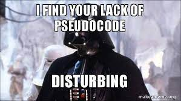

## Tyler's Bootcamp Blog

Welcome to my weekly blog about my Coding Bootcamp experience!
My goal is to post weekly updates on what I have learned that week. Along with any challenges and break throughs.

Let's Git it!

# August 27, 2021
The first week of onboarding is now drawing to a close. This bootcamp may be one of the most challenging things I have ever done, and I can't wait! I was certainly nervous getting started, as I hadn't the faintest idea about coding. But now at the close of week one I am much more confident that I am exactly where I am supposed to be. My particular style of learning has always been hands on, and this is how the bootcamp is set up. In the first week we have already dove deep into Github and Codeanywhere. I am not ashamed to say that the two really kicked my butt, but I am also proud to say that by the end of the week I am **WAY** more confident with both!  I'm hopeful that I will continue to grasp the concepts that are constantly getting thrown at me. I can't wait to see what we learn next!

# September 13, 2021
Welcome to the third week, and the third entry, of my weekly Coding Bootcamp Blog. This week we dove deep into using Javascript, and let me tell you it was so much fun! Seeing how important it is for HTML, CSS, and Javascript to work together to bring a page to life was really interesting. But, my favorite day had to be when we went through and debugged code. As someone who loves puzzles and finding things, it was definetly my favorite thing we have done so far. One of my blockers this week though has been the use of Psuedocode. Using psuedocode to lay down the outline for a project is a great resource ,but I found that it was difficult to really plan out the code in advance. As I still don't feel very comfortable with knowing the layout of of the code it was definitly a challenge to do, and I know I will need more practice with it. Last week I wrote my blog post using HTML in order to practice, I feel like this coming week I will be trying to use more psuedocoding as practice as well.

Tune in next week for another update on my journey!

